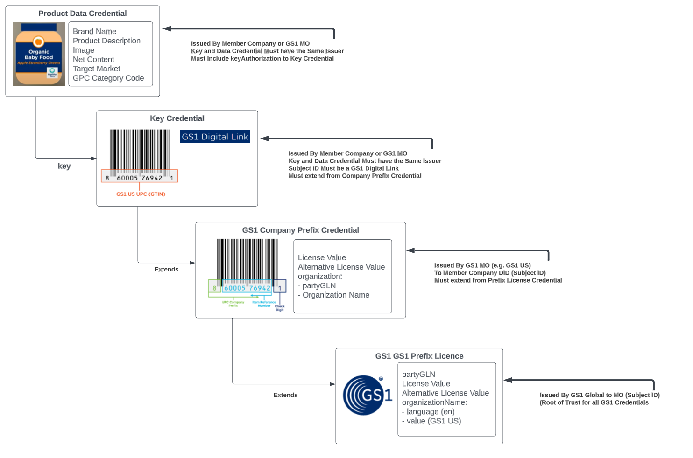

# Overview 
The GS1 US Decentralized Identifier & Verifiable Credentials solution has been created to provide guidance on how to verify Verifiable Credentials (VC) issued for the GS1 Verifiable Credentials ecosystem. 

Currently this solution is built for the [WC3 Verifiable Credentials Data Model 1.1](https://www.w3.org/TR/vc-data-model) and the validation rules defined in the [GS1 Data Model](https://ref.gs1.org/gs1/vc/data-model) to validate the root of trust with GS1 issued credentials.

The GS1 US Verifiable Credentials Verification solution is divided into two libraries. 

- [vc-verifier-core](https://github.com/gs1us-technology/vc-verifier-core): This is the core library for verifying GS1 US Based Verifiable Credentials. This library is the main library to use for verifying VCs. The library will perform proof and revocation checks on all presented VCs. 
- [vc-verifier-rules](https://github.com/gs1us-technology/vc-verifier-rules): This is the rules library for verifying GS1 US Based Verifiable Credentials. This library will validate GS1 based VCs and ensure they follow the level four business rules defined by the GS1 Data Model Document. 

**Notes**: To run the libraries locally you will need to clone both repos into a parent Folder (e.g. gs1-us). The vc-verifier-core library has a dependency on the vc-verifier-rules and requires running a local NPM Install. See the using the library section for more details. 

# GS1 Credential Data Model
## Overview 

When validating GS1 Credentials the verification process will need to resolve each level of the verifiable credential chain. This will be done by checking for the next verifiable credential (VC) in the hierarchy chain is included in the verifiable presentation. 
If the required verifiable credential is not in the presentation, the verification process should resolve the verifiable credential via the document loader. Any resolved verifiable credential should pass proof and revocation checks prior to completing the GS1 Credential validation rules check.  

Below is the credential chain for the ProductDataCredential. The validation flow will only check the specific VC passed into the rules engine and its related credential chain. If a company prefix VC is passed in it will validate the VC subject fields and then check the extended credential rules between a company prefix and license prefix credential. 
When a ProductDataCredential is passed in its subject field validation requires resolving both its related key credential and company prefix. This is required because the key credential only defines the relationship to the GS1 Key (GLN, GTIN, Etc.) and not the underlying data.  

To validate a ProductDataCredential in addition to checking its related key credential is valid, the company prefix associated with the key credential must be resolved and required checks for the issuer of the ProductDataCredential -> GS1KeyCredential -> GS1CompanyPrefixLicenceCredential. 


   
## List of GS1 credentials Supported By the Rules Library
- GS1PrefixLicenceCredential
- GS1CompanyPrefixLicenceCredential 
- OrganizationDataCredential 
- ProductDataCredential
- GS1IdentificationKeyLicenceCredential 

# Library Runtime

The library is a JavaScript based NPM package that is built on top of the WC3 standards libraries provided by Digital Bazaar. The library can be consumed directly using the library index.js file or using the bundled and minified version of the library. 

The library requires the following environment:
- Node - v18.16.1+
- NPM - 9.5.1+

# Repo Folders
- `src\lib`: The main code for the GS1 US vc-verifier-rules JavaScript library.
- `src\lib\rules-schema`: JSON Schema Rules for GS1 Credentials
- `src\lib\rules-definition`: JavaScript Functions for validating GS1 Credentials

# Running the Library Locally 
To use the GS1 US Decentralized Identifier & Verifiable Credentials rules library clone the [vc-verifier-rules](https://github.com/gs1us-technology/vc-verifier-rules) library. 

After cloning open the `vc-verifier-rules` library and perform the following steps from the top folder for vc-verifier-rules.

The  `npm run dev` command will compile the library into it's dist folder. 

``` 
npm install
npm run dev
``` 

# Using the Library
To use the GS1 US Decentralized Identifier & Verifiable Credentials rules library in your own solution. Do a local 'npm install ../vc-verifier-rule'. 

This will install the library and its dependencies into your local node_modules folder. 

## Referencing the Library 
Add the following to reference the library your local code.
``` typescript
import { verifyGS1CredentialsInPresentation, 
        checkGS1CredentialWithoutPresentation, 
        externalCredential, 
        verifyExternalCredential, 
        gs1RulesResult,  
        gs1RulesResultContainer, 
        verificationErrorCode, 
        VerifiableCredential } 
    // @ts-ignore
    from '@gs1us/vc-verifier-rules';
``` 

## Library API
The library includes two methods for verifying credentials.

export async function verifyGS1CredentialsInPresentation(externalCredentialLoader: externalCredential, externalCredentialVerification: verifyExternalCredential, verifiablePresentation: any) : Promise<gs1RulesResultContainer> {

- `verifyGS1CredentialsInPresentation` Check if the Verifiable Presentation for any GS1 Credential and if so check the GS1 Credential Rules
- `checkGS1CredentialWithoutPresentation` Check if the Verifiable Credential is a GS1 Credential and if so check the GS1 Credential Rules

## Code Example
Here is an example of calling the `verifyGS1CredentialsInPresentation` method in the library. This will check the presentation for any GS1 Credentials and verify them against the 
GS1 level four business rules including ensuring the credentials chain is validate and the GS1 Global DID is the root issuer. 

Take note there are two call back methods that must be provided:
- 'externalCredentialLoader' this method will be called when one of the required GS1 credential can not be found in the presentation
- 'verifyExternalCredential' this method is called to verify any externally resolved credentials 

``` typescript
// Callback function to resolve external credential using the document loader 
// This code can be found in the vc-verifier-core library 
const getExternalCredential: externalCredential = async (url: string) : Promise<VerifiableCredential> => {
    const extendedVC = await documentLoader(url);
    return extendedVC.document;
}

// Callback function to verify external credential to ensure the VC passes proof, revocation and GS1 Rules
// This code can be found in the vc-verifier-core library 
const checkExternalCredential: verifyExternalCredential = async (credential: VerifiableCredential) : Promise<gs1RulesResult> => {
    const verificationResult =  await verifyCredential_Direct(credential);

    // Developer Note: Since we are only checking a single credential we can assume the first credential result is the one we want to check
    let validationErrors: any[] = [];
    if (verificationResult.credentialResults.length > 0) {
            validationErrors = verificationResult.credentialResults[0].error?.errors.map( (error: any) => {
                return { code: verificationErrorCode, rule: error.message, isValid: false };
        });
    }

    // Check GS1 Rules for external credential
    const gs1RulesResult = await checkGS1Credential(credential);

    // Merge Verification Errors with GS1 Rules Errors
    if  (validationErrors && validationErrors.length > 0) {
        gs1RulesResult.errors.push(...validationErrors);
        gs1RulesResult.verified = false;
    }

    return gs1RulesResult;
}

const verifiablePresentation = getTestPresentation("company-prefix-organization-key-08.json");
const vcResylt: gs1RulesResultContainer = await verifyGS1CredentialsInPresentation(getExternalCredential, checkExternalCredential, verifiablePresentation);

if (vcResult.verified === true) {
   console.log("Success");
} else {
  console.log(JSON.stringify(vcResult, null, 4));
```

## Library Output 
TBD


